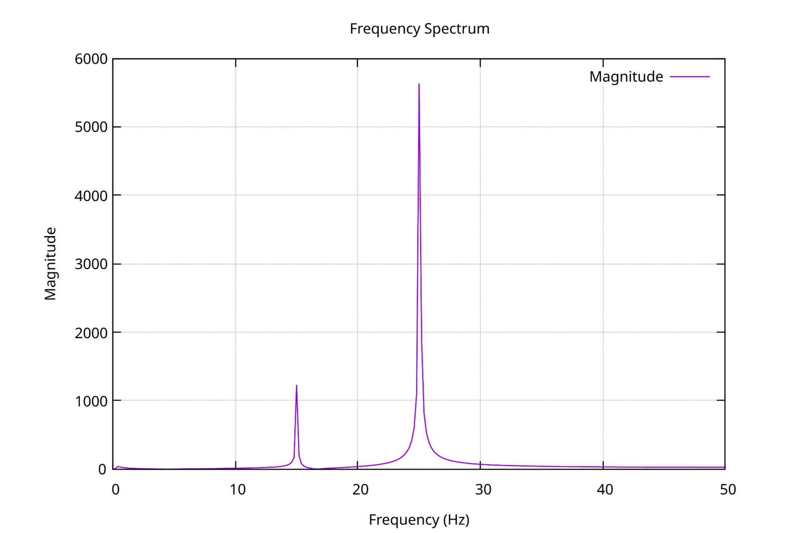

# Звіт

## Мета роботи

Визначити суттєві частотні складові ($f_i$) у спостережуваній дискретній функції $\hat{y}(t_i)$, 
яка змодельована як сума кубічного полінома та кількох синусоїд. 
Аналіз виконано за допомогою Дискретного перетворення Фур'є.

## Методологія

Аналіз сигналу проводився в кілька етапів:

1.  **Зчитування та підготовка даних:** Вхідні дані були завантажені з файлу `f20.txt`. 
Був згенерований відповідний часовий вектор з кроком $\Delta t = 0.01$ с в інтервалі с.

2.  **Видалення тренду:** Початковий сигнал містить неперіодичну складову у вигляді кубічного полінома 
($a_1t^3 + a_2t^2 + a_3t + C$). Цей тренд має значну енергію на низьких частотах і може 
замаскувати корисні синусоїдальні сигнали при аналізі в частотній області. 
Для його усунення була застосована **поліноміальна регресія** методом найменших квадратів, 
яка дозволила знайти коефіцієнти полінома. Після цього розрахований тренд був віднятий від вихідного сигналу.

3.  **Частотний аналіз:** До очищеного від тренду сигналу було застосовано 
**Швидке перетворення Фур'є (FFT)** — ефективний алгоритм для обчислення ДПФ. 
Це дозволило перетворити сигнал із часової області в частотну й отримати його спектр.

4.  **Пошук піків та визначення частот:** У отриманому спектрі амплітуд був виконаний 
пошук локальних максимумів (піків), які відповідають домінуючим частотам у сигналі. 
Для відсіювання шуму та несуттєвих коливань був застосований поріг, що дозволило 
виділити лише значущі частотні компоненти.

## Використані бібліотеки та інструменти

Для реалізації програми на C++ були обрані наступні бібліотеки:

* **Eigen:** Високопродуктивна бібліотека для лінійної алгебри. 
Була обрана для реалізації поліноміальної регресії завдяки своєму зручному API, 
що дозволяє записувати математичні операції з матрицями та векторами в чистому та читабельному вигляді, 
а також завдяки наявності надійних та чисельно стійких розв'язувачів для задач найменших квадратів.

* **FFTW3 (The Fastest Fourier Transform in the West):** Де-факто стандарт 
для високопродуктивних обчислень Швидкого перетворення Фур'є. Ця бібліотека була обрана через 
її виняткову швидкість, яка досягається шляхом самооптимізації під конкретну апаратну архітектуру.

* **gnuplot-iostream:** Інтерфейсна бібліотека для взаємодії з утилітою для побудови графіків Gnuplot. 
Вона була обрана як простий та ефективний спосіб візуалізації результатів 
(зокрема, спектру частот) безпосередньо з термінального C++ додатка, не вимагаючи інтеграції 
складних графічних бібліотек.

## Результати аналізу

У результаті виконання програми були знайдені наступні суттєві частоти в сигналі:

| Частота (Гц) | Спектральна амплітуда | Розрахована амплітуда |
|:-------------|:----------------------|:----------------------|
| 15           | 1222.69               | 4.88207               |
| 25           | 5623.53               | 22.4492               |

### Графік модуля перетворення Фур'є

## Висновок

Розроблена програма успішно виконала поставлену задачу. Метод, що поєднує попереднє видалення 
поліноміального тренду та подальший аналіз за допомогою Швидкого перетворення Фур'є, довів свою 
ефективність для ідентифікації прихованих періодичних складових у складному сигналі. 
Використання спеціалізованих бібліотек, таких як Eigen та FFTW, дозволило досягти високої точності 
та продуктивності обчислень.